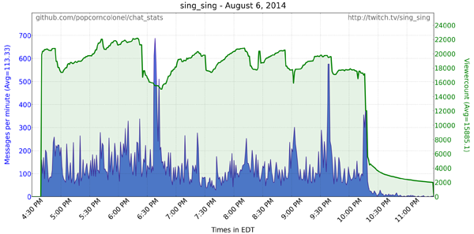
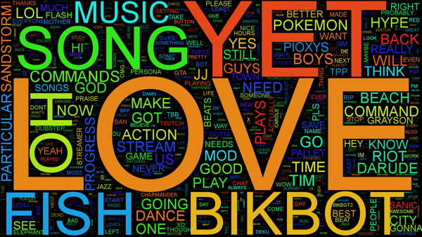
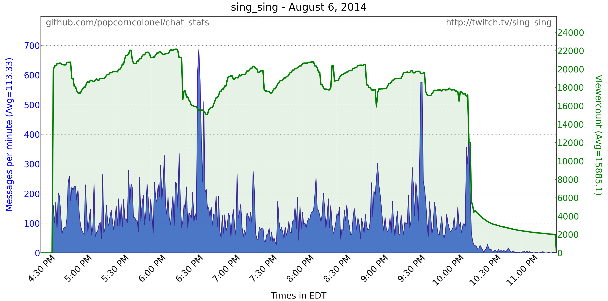
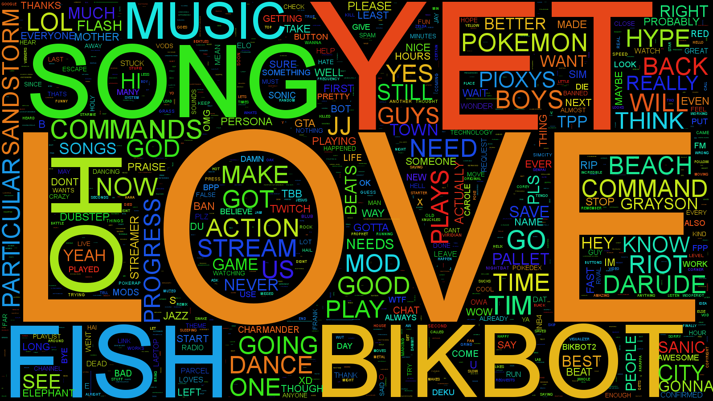

###What is this?###
This is a visualizer for Twitch chat. First, you set it to record the stream. When you're done recording, the program automatically generates a graph of stream activity (chat rate and viewership) over time, then generates a few word clouds that help to visualize the chat experience. Examples of both can be found in the "examples" directory of this repository.

Examples:  

###You can now download this program as a .exe!###
[Download Link](http://www.mediafire.com/download/i6fv2d63a51ig1c/chat_stats.zip). Just unzip the files, double click on chat_stats.exe, and input the channel you want to record!  

Note: This should work on any Windows PC without having to install anything prior. If it doesn't, [please let me know immediately](mailto:popcorncolonel@gmail.com)!

**Pros**  
Don't need to download the numberous Python dependencies listed below  
Easy, just double-click on the .exe and input the channel.  

**Cons**  
Filesize for the .exe is about 40x bigger than all the Python files in this repository, since I need to include all the imaging libraries to actually save the images.  
Can't manually call make_plot.py or make_cloud.py to re-make the images

###USAGE###
####To start recording
* "**python chat_stats.py [channel]**"

####To analyze data (optional - the images are still generated if you don't run this command):  
* "**python log_reader.py [channel] [date] [type]**"
    * Where [type] is an element of {'words', 'emotes', 'authors', 'messages'}

####To manually create images (optional):
* "**python make_plot.py [channel] [time]"** 
    * (ex. *python make_plot.py beatsplaypokemon 2014-08-09-11PM*)
* "**python make_cloud.py [channel] [time]**" 
    * (ex. *python make_cloud.py beatsplaypokemon 2014-08-09-11PM*)

###GETTING THE DATA###
* Check the logs directory that is created after running chat_stats.py 
* Get the name of the directory you want to read from.  
* Use the command "python log_reader.py [channel] [dir name] [name of log file]"  

###DEPENDENCIES###
* Python 2.7.
* [Matplotlib](http://matplotlib.org/downloads.html) - Graph creation (if you keep create_images as True).  
* [Word_cloud](https://github.com/amueller/word_cloud) - Word cloud creation. This can be a pain to install on Windows though. An alternative to this is just to copy+paste the contents of words.log to [http://www.wordle.net](http://www.wordle.net).  
    * [Python Imaging Library](http://www.pythonware.com/products/pil/) - Word cloud creation.  
    * [Cython](http://cython.org/#download) - Word cloud creation.  
* [Python-Dateutil](https://pypi.python.org/pypi/python-dateutil) - Timezone analysis  

###TODO###
* Words per message?  
* Create images (graphs) of the most used emotes

###"I found a bug!"###
[Email me](mailto:eric@ebcmsoftware.com) or [Tweet me](http://twitter.com/popcorncolonel)

###EXAMPLES###
NOTE: These images may be shrunken down, so if they're hard to read, click on them and view the full version.

**Stream activity over time**:

**Stream activity over time**, with optional event labels:

**Emote cloud**:

**Word cloud** (by default, word clouds do not include emotes. To change this, just change "include_emotes" in global_consts.py):

